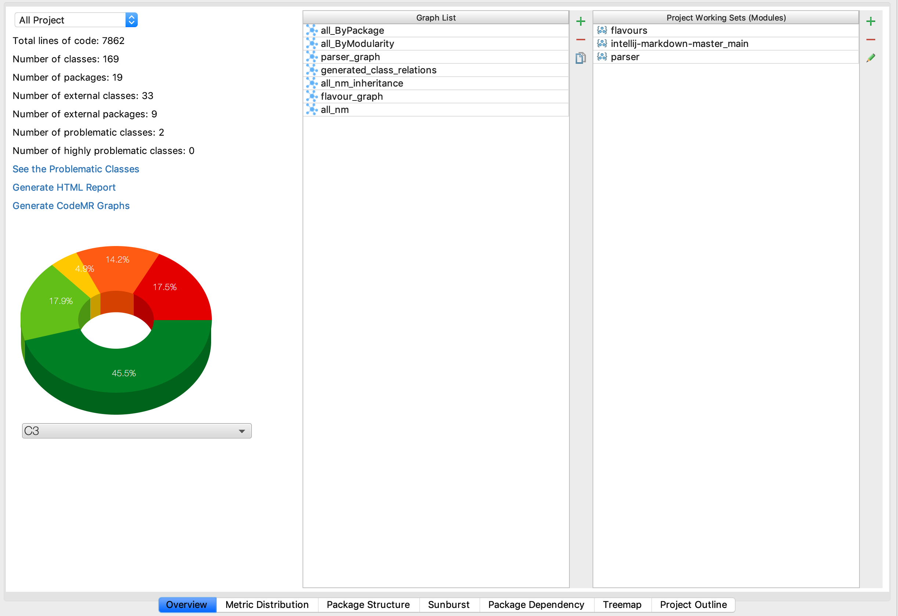
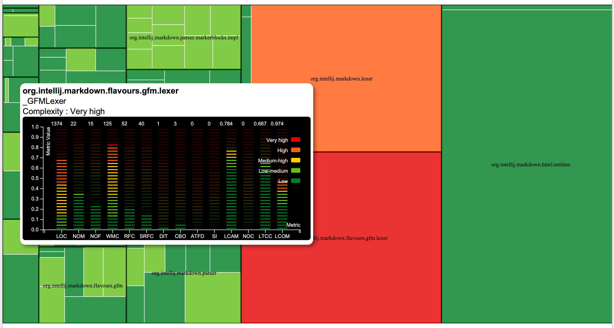
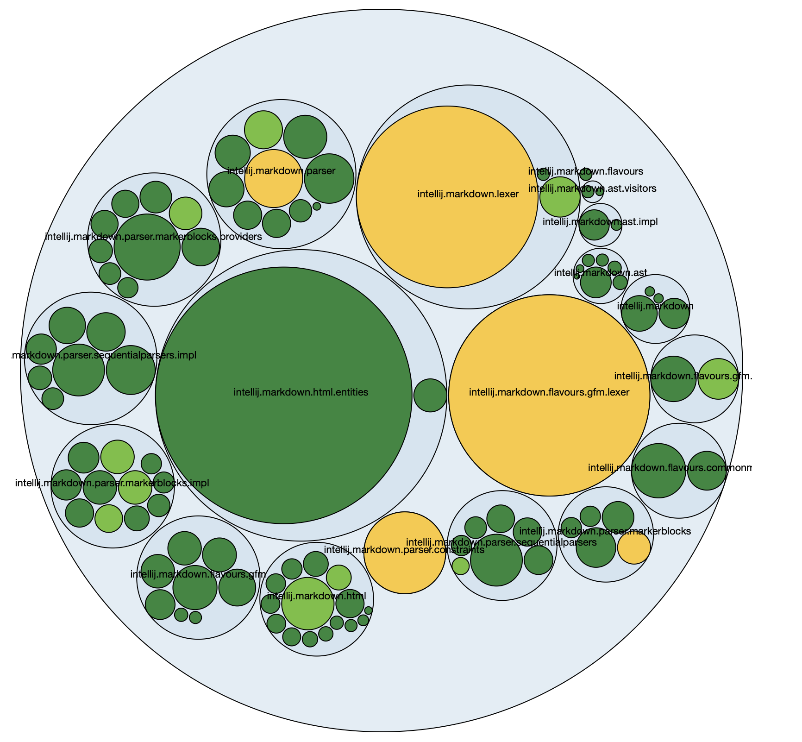
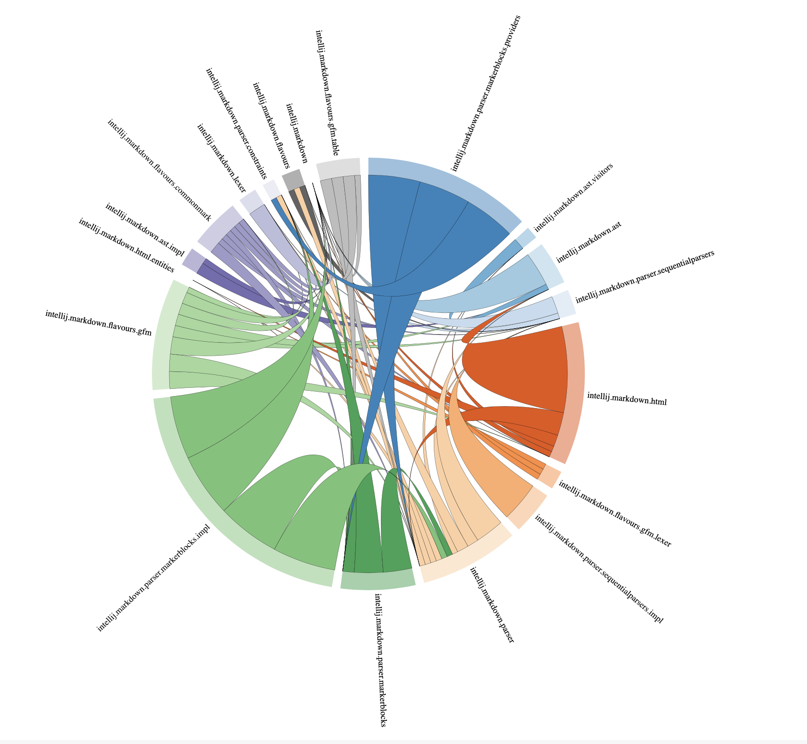
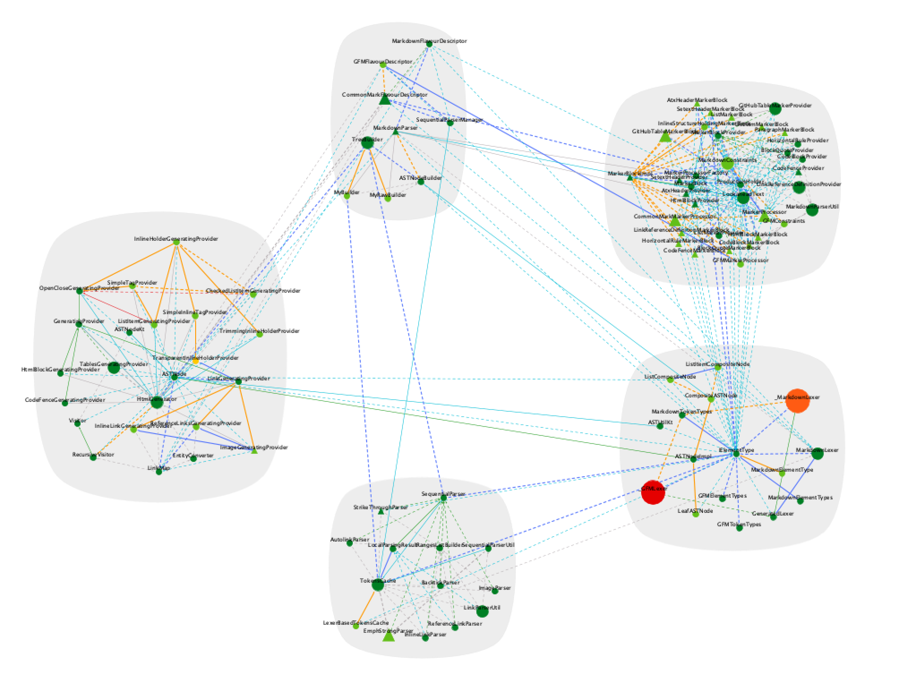
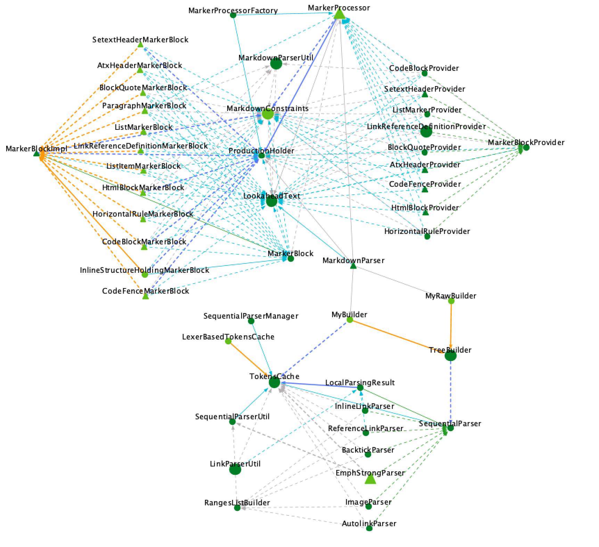
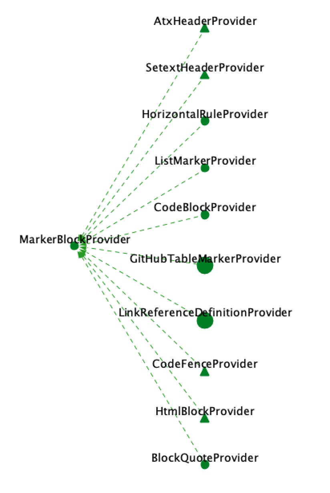
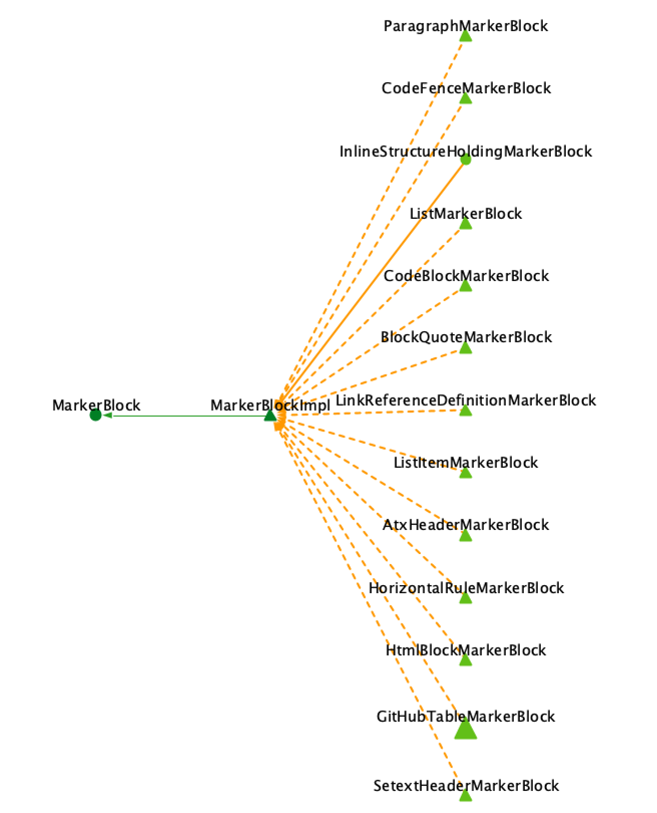
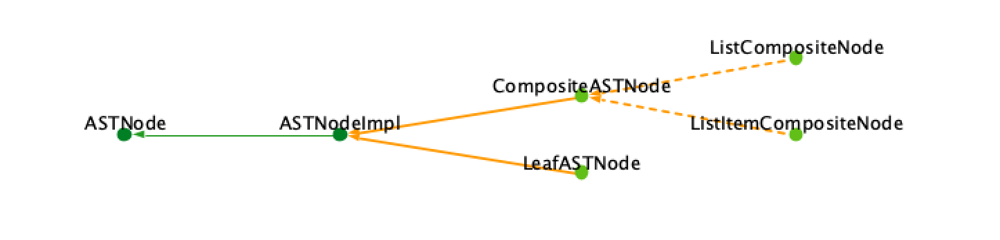
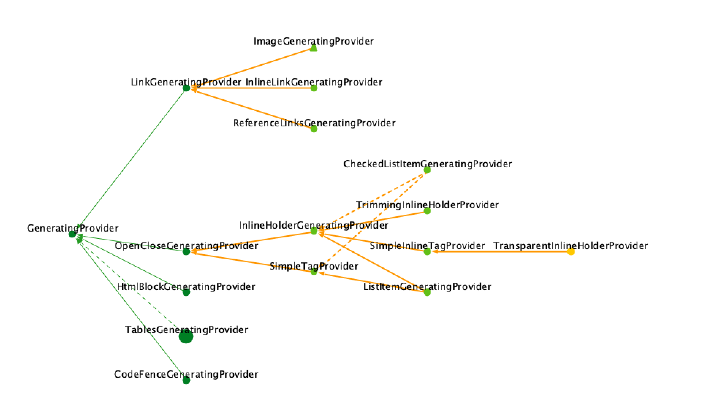

CodeMR Report for IntelliJ Markdown
=================

You can download or clone the project to use the existing extracted model and graphs. 
You can create your graphs, your working sets and analyse the project based on the extracted model without limitation. 
You can download CodeMR plugins for your favorite IDE from:
- [CodeMR for IntelliJ](https://plugins.jetbrains.com/plugin/10811-codemr)
- [CodeMR for Eclipse](https://marketplace.eclipse.org/content/codemr-software-quality-tool) 

See CodeMR [web site](https://www.codemr.co.uk) for details on the CodeMR.
You can download [trial license](https://www.codemr.co.uk/downloads) to try CodeMR for other projects.

CodeMR model path: ./codemr/intellij-markdown/intellij-markdown.mdl

### Snapshots ###

#### Overview #### 

#### Core Module Complexity TreeMap View #### 

#### Package Structure Cohesion View #### 

#### Package Dependency View #### 

#### Modularity Graph #### 

#### Parser Classes #### 

#### Implements and Inheritance Relations #### 

